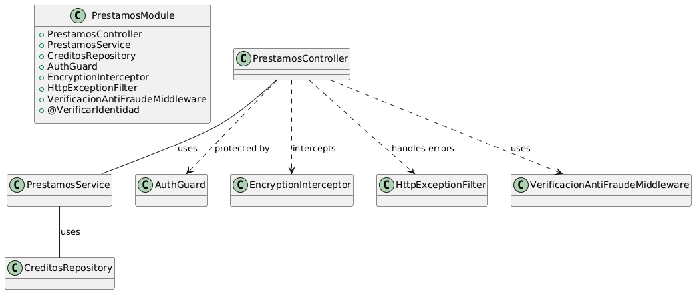

## Componentes Principales en una Aplicación NestJS

### 1. **Módulos (Modules)**
- **Qué Son**: Agrupan funcionalidades relacionadas en la aplicación.
- **Ejemplo**: `PrestamosModule` organiza todo lo relacionado con préstamos, desde la solicitud hasta el desembolso.

### 2. **Controladores (Controllers)**
- **Qué Son**: Manejan las solicitudes HTTP y responden al cliente.
- **Ejemplo**: `PrestamosController` gestiona rutas como `POST /solicitar` para pedir un préstamo.

### 3. **Servicios (Services)**
- **Qué Son**: Contienen la lógica de negocio y son utilizados por los controladores.
- **Ejemplo**: `PrestamosService` realiza cálculos de intereses y verifica la solvencia.

### 4. **Proveedores (Providers)**
- **Qué Son**: Clases que pueden ser inyectadas como dependencias, como servicios o repositorios.
- **Ejemplo**: `CreditosRepository` maneja las operaciones en la base de datos para solicitudes de crédito.

### 5. **Guardias (Guards)**
- **Qué Son**: Controlan el acceso a ciertas rutas para asegurar que solo los usuarios autorizados puedan acceder a ellas.
- **Ejemplo**: `AuthGuard` protege rutas sensibles como `POST /transferirFondos`.

### 6. **Interceptors**
- **Qué Son**: Manipulan los datos antes de llegar al controlador o antes de enviarlos al cliente.
- **Ejemplo**: `EncryptionInterceptor` cifra la información sensible.

### 7. **Filtros de Excepción (Exception Filters)**
- **Qué Son**: Manejan y personalizan las respuestas de error.
- **Ejemplo**: `HttpExceptionFilter` proporciona mensajes claros en caso de errores.

### 8. **Middleware**
- **Qué Son**: Funciones que se ejecutan antes de que una solicitud llegue al controlador.
- **Ejemplo**: `VerificacionAntiFraudeMiddleware` detecta comportamientos sospechosos en solicitudes de préstamos.

### 9. **Decoradores Personalizados (Custom Decorators)**
- **Qué Son**: Añaden metadatos adicionales a clases, métodos o propiedades.
- **Ejemplo**: `@VerificarIdentidad()` asegura que los datos del cliente sean verificados.

---

## Ejemplo Práctico: Aplicación Fintech para Préstamos Personales

**Caso de Uso**: Una aplicación fintech para préstamos personales automatizados donde los usuarios pueden solicitar préstamos, verificar elegibilidad y recibir fondos.

# Imagen de flujo 

### Explicación del Diagrama
- **PrestamosModule**: Agrupa todos los componentes relacionados con la gestión de préstamos.
- **PrestamosController**: Maneja las rutas HTTP para solicitar y verificar préstamos.
- **PrestamosService**: Contiene la lógica de negocio para los préstamos.
- **CreditosRepository**: Maneja la base de datos para las solicitudes de crédito.
- **AuthGuard**: Protege rutas críticas asegurando que solo usuarios autenticados puedan acceder.
- **EncryptionInterceptor**: Cifra datos sensibles.
- **HttpExceptionFilter**: Personaliza las respuestas de error.
- **VerificacionAntiFraudeMiddleware**: Detecta comportamientos sospechosos en las solicitudes.

---
