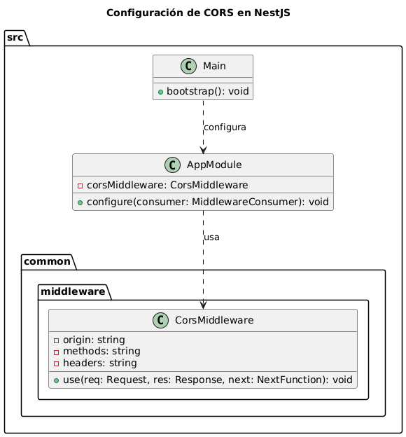

### ¿Qué es CORS?

**CORS** (Cross-Origin Resource Sharing) es una política de seguridad implementada por los navegadores web para permitir o restringir solicitudes de recursos entre diferentes dominios. Por ejemplo, si tu API está en `api.ejemplo.com` y tu sitio web está en `www.ejemplo.com`, CORS decide si `www.ejemplo.com` puede hacer solicitudes a `api.ejemplo.com`.

#### **Cómo Funciona:**

1. **Solicitud de Origen Cruzado:** Cuando un navegador intenta hacer una solicitud a un dominio diferente (origen cruzado), envía una solicitud HTTP con una cabecera `Origin`.
2. **Respuesta del Servidor:** El servidor responde con cabeceras específicas que indican si la solicitud debe ser permitida o bloqueada.

#### **Cabeceras Importantes:**

- **`Access-Control-Allow-Origin`:** Especifica qué dominios están permitidos para acceder a los recursos.
- **`Access-Control-Allow-Methods`:** Define qué métodos HTTP (GET, POST, etc.) están permitidos.
- **`Access-Control-Allow-Headers`:** Enumera las cabeceras que se pueden usar en la solicitud.

---

### Implementación de CORS en NestJS

**NestJS** es un framework para Node.js que facilita la creación de aplicaciones backend. Configurar CORS en NestJS es sencillo y puede hacerse de dos maneras: directamente en el archivo `main.ts` o usando un middleware personalizado.

#### **1. Configuración Directa en `main.ts`:**

1. **Archivo `main.ts`:** Es el punto de entrada de tu aplicación NestJS. Aquí puedes configurar CORS directamente.

   ```typescript
   import { NestFactory } from '@nestjs/core';
   import { AppModule } from './app.module';
   import { CorsOptions } from '@nestjs/common/interfaces/external/cors-options.interface';

   async function bootstrap() {
     const app = await NestFactory.create(AppModule);
     
     const corsOptions: CorsOptions = {
       origin: 'http://example.com',  // Dominios permitidos
       methods: 'GET,HEAD,PUT,PATCH,POST,DELETE',  // Métodos permitidos
       credentials: true,  // Permitir cookies y credenciales
     };
     
     app.enableCors(corsOptions);
     await app.listen(3000);
   }
   bootstrap();
   ```

   **Explicación:**
   - **`origin`**: Define qué dominios están permitidos para hacer solicitudes a tu API.
   - **`methods`**: Lista de métodos HTTP que se permiten.
   - **`credentials`**: Permite el envío de cookies y otros datos de autenticación.

#### **2. Configuración Usando Middleware (Opcional):**

1. **Crear Middleware:**

   Si necesitas una configuración más específica, puedes crear un middleware.

   ```typescript
   import { Injectable, NestMiddleware } from '@nestjs/common';
   import { Request, Response, NextFunction } from 'express';

   @Injectable()
   export class CorsMiddleware implements NestMiddleware {
     use(req: Request, res: Response, next: NextFunction) {
       res.header('Access-Control-Allow-Origin', 'http://example.com');
       res.header('Access-Control-Allow-Methods', 'GET,HEAD,PUT,PATCH,POST,DELETE');
       res.header('Access-Control-Allow-Headers', 'Origin, X-Requested-With, Content-Type, Accept');
       next();
     }
   }
   ```

2. **Registrar Middleware en `app.module.ts`:**

   ```typescript
   import { Module, MiddlewareConsumer } from '@nestjs/common';
   import { CorsMiddleware } from './common/middleware/cors.middleware';

   @Module({
     imports: [],
   })
   export class AppModule {
     configure(consumer: MiddlewareConsumer) {
       consumer
         .apply(CorsMiddleware)
         .forRoutes('*');  // Aplica el middleware a todas las rutas
     }
   }
   ```

**Explicación:**
- **Middleware**: Permite una configuración personalizada de CORS al añadir las cabeceras necesarias a las respuestas HTTP.

#### **Probar la Configuración:**

1. **Ejecuta tu aplicación:**

   ```bash
   npm run start
   ```

2. **Verifica que la configuración de CORS esté funcionando:** Intenta hacer solicitudes desde un dominio diferente al especificado en la configuración para comprobar si las respuestas contienen las cabeceras CORS adecuadas.

---

### Resumen

- **CORS** controla cómo los recursos de un servidor pueden ser solicitados desde un dominio diferente.
- **En NestJS**, puedes habilitar CORS directamente en `main.ts` o usando un middleware para una configuración más avanzada.
- **Configuración en `main.ts`**: Simple y directa, ideal para la mayoría de los casos.
- **Middleware**: Ofrece más control sobre la configuración de CORS, útil para necesidades específicas.

- **Importante**: Asegúrate de incluir las cabeceras CORS necesarias en tus respuestas HTTP para permitir solicitudes cruzadas de dominio.
- **Prueba**: Verifica que tu configuración de CORS esté funcionando correctamente.
- **Documentación**: Consulta la documentación de NestJS y CORS para obtener más información y opciones de configuración.

# Imagen de flujo 
