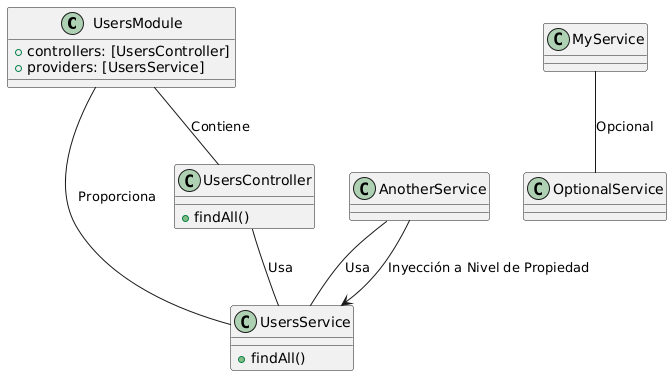

### 💉 Inyección de Dependencias en NestJS

#### ¿Qué es la Inyección de Dependencias?

La Inyección de Dependencias (Dependency Injection) es un patrón de diseño ampliamente utilizado en programación para gestionar las dependencias entre objetos. En lugar de que un objeto cree sus dependencias directamente, estas se inyectan desde el exterior, promoviendo una arquitectura más modular, flexible y fácil de probar.

#### ¿Por qué usar Inyección de Dependencias en NestJS?

1. **Modularidad y Reutilización:**
   La inyección de dependencias permite que servicios y componentes sean modulares y reutilizables. Puedes reemplazar fácilmente una implementación por otra sin modificar el código que utiliza esas dependencias.

2. **Facilidad de Pruebas:**
   Los componentes inyectados pueden ser fácilmente simulados (mocked) en pruebas, facilitando la creación de tests unitarios y de integración.

3. **Mantenimiento y Escalabilidad:**
   Facilita el mantenimiento y la escalabilidad del proyecto al mantener las dependencias desacopladas y gestionadas por el framework, en este caso, NestJS.

#### ¿Cómo funciona la Inyección de Dependencias en NestJS?

1. **Creación de un Servicio**

   Un servicio es una clase que contiene la lógica de negocio de la aplicación. Puedes crear un servicio utilizando el CLI de NestJS:

   ```bash
   nest g s users
   ```

   Esto generará un archivo de servicio básico en `users.service.ts`:

   ```typescript
   import { Injectable } from '@nestjs/common';

   @Injectable()
   export class UsersService {
     private users = [];

     findAll() {
       return this.users;
     }
   }
   ```

2. **Inyección de un Servicio en un Controlador**

   Para usar este servicio en un controlador, simplemente lo inyectamos a través del constructor:

   ```typescript
   import { Controller, Get } from '@nestjs/common';
   import { UsersService } from './users.service';

   @Controller('users')
   export class UsersController {
     constructor(private readonly usersService: UsersService) {}

     @Get()
     findAll() {
       return this.usersService.findAll();
     }
   }
   ```

   En este ejemplo, `UsersService` se inyecta en `UsersController`, lo que permite al controlador utilizar los métodos definidos en el servicio.

3. **Configuración de un Módulo**

   Los servicios y controladores deben ser registrados en un módulo. En `users.module.ts` se registran ambos:

   ```typescript
   import { Module } from '@nestjs/common';
   import { UsersService } from './users.service';
   import { UsersController } from './users.controller';

   @Module({
     controllers: [UsersController],
     providers: [UsersService],
   })
   export class UsersModule {}
   ```

   Aquí, `UsersService` se proporciona en el módulo, lo que lo hace disponible para su inyección en cualquier lugar de `UsersModule`.

#### Tipos de Inyección de Dependencias en NestJS

1. **Inyección Básica:**
   Es la forma más común de inyección, donde las dependencias se inyectan directamente a través del constructor.

2. **Inyección a Nivel de Propiedad:**
   Aunque menos común, también es posible inyectar dependencias directamente en propiedades de la clase utilizando decoradores.

   ```typescript
   import { Injectable, Inject } from '@nestjs/common';
   import { UsersService } from './users.service';

   @Injectable()
   export class AnotherService {
     @Inject(UsersService)
     private readonly usersService: UsersService;
   }
   ```

3. **Inyección Opcional:**
   Puedes marcar una dependencia como opcional, lo que permite que la aplicación continúe funcionando incluso si la dependencia no está disponible.

   ```typescript
   import { Injectable, Optional } from '@nestjs/common';
   import { OptionalService } from './optional.service';

   @Injectable()
   export class MyService {
     constructor(@Optional() private readonly optionalService?: OptionalService) {}
   }
   ```

#### Conclusión

La inyección de dependencias en NestJS es fundamental para construir aplicaciones modulares, escalables y fáciles de mantener. Este patrón de diseño no solo simplifica el código, sino que también mejora la capacidad de prueba y facilita la gestión de dependencias en aplicaciones complejas. Implementar correctamente la inyección de dependencias te permitirá aprovechar al máximo las capacidades de NestJS.

# Imagen de flujo 


### Explicación del Diagrama UML

- **`UsersService`**: Servicio que contiene la lógica de negocio.
- **`UsersController`**: Controlador que maneja las solicitudes HTTP y utiliza `UsersService`.
- **`UsersModule`**: Módulo que agrupa `UsersController` y `UsersService`.
- **`AnotherService`**: Servicio que utiliza `UsersService` a través de inyección a nivel de propiedad.
- **`OptionalService`**: Servicio opcional que puede ser inyectado en `MyService`.

Este diagrama ilustra cómo los servicios y controladores se relacionan en un módulo, y cómo la inyección de dependencias permite a los componentes interactuar de manera flexible y modular.