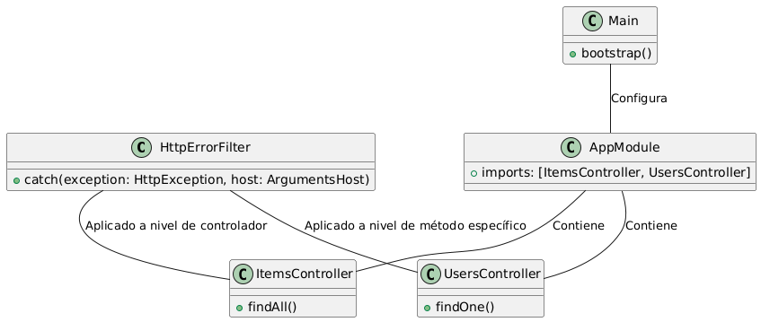

Aquí está la teoría simplificada y un ejemplo detallado en PlantUML para la implementación de Exception Filters en NestJS:

### Teoría Simplificada sobre Exception Filters

**Exception Filters** en NestJS gestionan los errores de manera centralizada, mejorando el manejo de errores en la aplicación. Permiten capturar y manejar errores de forma consistente, proporcionando respuestas claras y protegiendo información sensible.

**¿Por qué usarlos?**
1. **Manejo Centralizado**: Capturan errores en un único lugar, facilitando su gestión.
2. **Experiencia del Usuario**: Ofrecen respuestas de error claras y consistentes.
3. **Seguridad**: Controlan la información expuesta en los mensajes de error.

**¿Cómo funcionan?**
1. **Creación**: Se usa el decorador `@Catch()` para definir cómo manejar excepciones.
2. **Aplicación**: Se pueden aplicar globalmente, a nivel de controlador, o en métodos específicos.

# Imagen de flujo 

### Explicación del Diagrama UML

1. **`HttpErrorFilter`**: Filtro de excepciones que maneja errores HTTP de forma personalizada.
   - **Método `catch`**: Captura excepciones y define la respuesta de error.

2. **`ItemsController`**: Controlador que maneja solicitudes relacionadas con ítems.
   - **Método `findAll`**: Ejemplo de cómo se lanza una excepción, que será manejada por el filtro.

3. **`UsersController`**: Controlador que maneja solicitudes relacionadas con usuarios.
   - **Método `findOne`**: Ejemplo de aplicación de `HttpErrorFilter` a nivel de método específico.

4. **`AppModule`**: Módulo raíz que importa y organiza los controladores.

5. **`Main`**: Punto de entrada que configura la aplicación y aplica el filtro globalmente.

Este diagrama muestra cómo los filtros de excepciones se integran en una aplicación NestJS, destacando su aplicación en diferentes niveles y su relación con otros componentes del sistema.