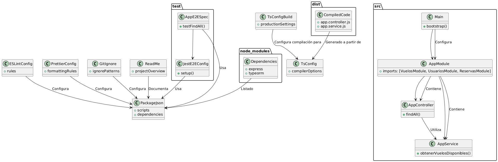

Claro, aquí tienes la teoría simplificada y un ejemplo en PlantUML para la estructura de archivos en una aplicación NestJS:

### Teoría Simplificada sobre la Estructura de Archivos

**1. `src/`: Carpeta Principal**
   - **Descripción**: Contiene el código fuente de la aplicación.
   - **Ejemplo**: Implementaciones de controladores, servicios y módulos.

**2. `test/`: Carpeta de Pruebas**
   - **Descripción**: Archivos para pruebas unitarias y de extremo a extremo.
   - **Ejemplo**: Pruebas para controlar el comportamiento de los controladores y servicios.

**3. `node_modules/`: Dependencias del Proyecto**
   - **Descripción**: Carpeta que contiene todas las dependencias instaladas.
   - **Ejemplo**: Librerías y paquetes necesarios para el funcionamiento de la aplicación.

**4. `dist/`: Código Compilado**
   - **Descripción**: Código JavaScript generado a partir del código TypeScript.
   - **Ejemplo**: Código listo para producción.

**5. `package.json`: Configuración del Proyecto**
   - **Descripción**: Incluye scripts, dependencias y metadatos del proyecto.
   - **Ejemplo**: Scripts para iniciar la aplicación y definir librerías necesarias.

**6. `tsconfig.json`: Configuración de TypeScript**
   - **Descripción**: Define cómo compilar el código TypeScript.
   - **Ejemplo**: Configuraciones para compilar TypeScript a JavaScript.

**7. `tsconfig.build.json`: Configuración de Construcción de TypeScript**
   - **Descripción**: Configuración específica para la compilación en producción.
   - **Ejemplo**: Optimización del código para el entorno de producción.

**8. `.eslintrc.js`: Configuración de ESLint**
   - **Descripción**: Define reglas para asegurar la calidad del código.
   - **Ejemplo**: Reglas para mantener un estilo de código consistente.

**9. `.prettierrc`: Configuración de Prettier**
   - **Descripción**: Define reglas para formatear el código.
   - **Ejemplo**: Reglas de formato para mantener un código limpio y legible.

**10. `.gitignore`: Archivos a Ignorar por Git**
   - **Descripción**: Lista de archivos y carpetas que Git debe ignorar.
   - **Ejemplo**: Evita que archivos temporales y dependencias sean seguidos por el control de versiones.

**11. `README.md`: Documentación del Proyecto**
   - **Descripción**: Contiene información básica sobre el proyecto.
   - **Ejemplo**: Instrucciones de configuración y uso del proyecto.

# Imagen de flujo 

### Explicación del Diagrama UML

1. **`src/`**: Carpeta principal con el código fuente.
   - **`AppController`**: Controlador básico que maneja rutas y métodos HTTP.
   - **`AppService`**: Servicio que contiene la lógica de negocio.
   - **`AppModule`**: Módulo raíz que organiza los componentes.
   - **`Main`**: Punto de entrada que configura la aplicación.

2. **`test/`**: Carpeta para pruebas unitarias y e2e.
   - **`AppE2ESpec`**: Pruebas de extremo a extremo para el controlador.
   - **`JestE2EConfig`**: Configuración de Jest para pruebas e2e.

3. **`node_modules/`**: Dependencias del proyecto.
   - **`Dependencies`**: Lista de paquetes instalados como Express y TypeORM.

4. **`dist/`**: Código JavaScript compilado.
   - **`CompiledCode`**: Código generado a partir de TypeScript.

5. **`package.json`**: Configuración del proyecto.
   - **`PackageJson`**: Define scripts, dependencias y metadatos.

6. **`tsconfig.json`**: Configuración de TypeScript.
   - **`TsConfig`**: Define cómo compilar TypeScript a JavaScript.

7. **`tsconfig.build.json`**: Configuración específica para la construcción.
   - **`TsConfigBuild`**: Configuración de compilación para producción.

8. **`.eslintrc.js`**: Configuración de ESLint.
   - **`ESLintConfig`**: Define reglas de estilo y calidad de código.

9. **`.prettierrc`**: Configuración de Prettier.
   - **`PrettierConfig`**: Define reglas de formato del código.

10. **`.gitignore`**: Archivos a ignorar por Git.
    - **`GitIgnore`**: Lista de patrones de archivos a ignorar.

11. **`README.md`**: Documentación del proyecto.
    - **`ReadMe`**: Proporciona una visión general y detalles sobre el proyecto.

Este diagrama ilustra la estructura de archivos y cómo se interrelacionan en una aplicación NestJS, reflejando su organización y propósito dentro de la arquitectura del proyecto.