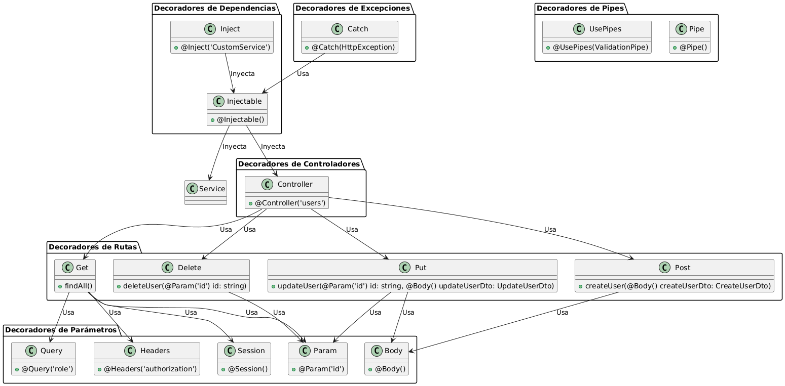

### Primeros Decoradores en NestJS

**¿Qué son los Decoradores?**
- Los decoradores son una característica avanzada de TypeScript que permiten añadir metadatos y modificar el comportamiento de clases, métodos, propiedades o parámetros en tiempo de ejecución.
- En NestJS, se utilizan para definir rutas, gestionar dependencias, manejar excepciones, y más.

**¿Por qué usar Decoradores en NestJS?**
1. **Simplicidad y Claridad**:
   - Permiten definir comportamientos de forma declarativa, haciendo el código más legible y fácil de entender.

2. **Consistencia y Mantenibilidad**:
   - Aseguran una estructura de código uniforme y facilitan el mantenimiento.

3. **Inyección de Dependencias**:
   - Facilitan la gestión de servicios y otras clases a través de la inyección de dependencias.

**Decoradores Comunes en NestJS**

1. **Decoradores de Rutas**:
   - **`@Get()`**: Define una ruta GET.
   - **`@Post()`**: Define una ruta POST.
   - **`@Put()`**: Define una ruta PUT.
   - **`@Delete()`**: Define una ruta DELETE.

2. **Decoradores de Parámetros**:
   - **`@Param()`**: Extrae parámetros de la URL.
   - **`@Body()`**: Extrae el cuerpo de la solicitud.
   - **`@Query()`**: Extrae parámetros de consulta.
   - **`@Headers()`**: Extrae encabezados de la solicitud.
   - **`@Session()`**: Extrae datos de la sesión del usuario.

3. **Decoradores de Controladores**:
   - **`@Controller()`**: Define una clase como un controlador y asocia rutas base.

4. **Decoradores de Inyección de Dependencias**:
   - **`@Injectable()`**: Marca una clase como un proveedor para inyección de dependencias.
   - **`@Inject()`**: Inyecta una dependencia específica.

5. **Decoradores de Excepciones**:
   - **`@Catch()`**: Define un filtro de excepciones personalizado.

6. **Decoradores de Pipes**:
   - **`@UsePipes()`**: Aplica pipes para transformar y validar datos.
   - **`@Pipe()`**: Define un pipe personalizado.

**Ejemplo Completo: CRUD de Usuarios**

```typescript
import { Controller, Get, Post, Put, Delete, Param, Body, UsePipes, ValidationPipe } from '@nestjs/common';
import { UsersService } from './users.service';
import { CreateUserDto } from './dto/create-user.dto';
import { UpdateUserDto } from './dto/update-user.dto';

@Controller('users')
export class UsersController {
  constructor(private readonly usersService: UsersService) {}

  @Get()
  findAll() {
    return this.usersService.findAll();
  }

  @Get(':id')
  findOne(@Param('id') id: string) {
    return this.usersService.findOne(id);
  }

  @Post()
  @UsePipes(new ValidationPipe())
  create(@Body() createUserDto: CreateUserDto) {
    return this.usersService.create(createUserDto);
  }

  @Put(':id')
  update(@Param('id') id: string, @Body() updateUserDto: UpdateUserDto) {
    return this.usersService.update(id, updateUserDto);
  }

  @Delete(':id')
  remove(@Param('id') id: string) {
    return this.usersService.remove(id);
  }
}
```


# Imagen de flujo 


### Explicación del Diagrama

1. **Decoradores de Rutas**: 
   - **`@Get()`, @Post(), @Put(), @Delete()`**: Definen las rutas HTTP para operaciones CRUD.

2. **Decoradores de Parámetros**:
   - **`@Param()`, @Body(), @Query(), @Headers(), @Session()`**: Extraen datos de la solicitud para los métodos del controlador.

3. **Decoradores de Controladores**:
   - **`@Controller()`**: Define una clase como un controlador y asigna rutas base.

4. **Decoradores de Dependencias**:
   - **`@Injectable()`**: Marca clases como inyectables para servicios.
   - **`@Inject()`**: Permite inyectar dependencias específicas.

5. **Decoradores de Excepciones**:
   - **`@Catch()`**: Define filtros para manejar excepciones.

6. **Decoradores de Pipes**:
   - **`@UsePipes()`**: Aplica pipes para validar y transformar datos.
   - **`@Pipe()`**: Define un pipe personalizado.

Este diagrama ilustra cómo se utilizan los decoradores en NestJS para definir rutas, manejar parámetros, gestionar dependencias, y más.