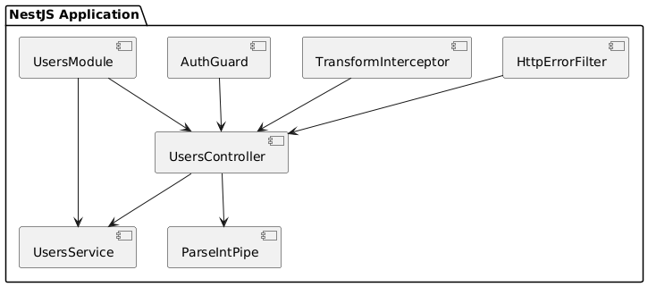

**Resumen Simplificado: Elementos Fundamentales de NestJS**

NestJS es un framework para crear aplicaciones del lado del servidor con TypeScript, enfocado en modularidad y escalabilidad. Aquí están sus bloques de construcción clave:

1. **Módulos**: Agrupan controladores y servicios para organizar el código. 
   - **Ejemplo**:
     ```typescript
     @Module({
       controllers: [UsersController],
       providers: [UsersService],
     })
     export class UsersModule {}
     ```

2. **Controladores**: Manejan las solicitudes HTTP y devuelven respuestas.
   - **Ejemplo**:
     ```typescript
     @Controller('users')
     export class UsersController {
       constructor(private readonly usersService: UsersService) {}
     
       @Get()
       findAll() {
         return this.usersService.findAll();
       }
     
       @Post()
       create(@Body() createUserDto: any) {
         return this.usersService.create(createUserDto);
       }
     
       @Get(':id')
       findOne(@Param('id') id: string) {
         return this.usersService.findOne(id);
       }
     }
     ```

3. **Servicios (Providers)**: Contienen la lógica de negocio y se pueden inyectar en controladores.
   - **Ejemplo**:
     ```typescript
     @Injectable()
     export class UsersService {
       private users = [];
     
       findAll() {
         return this.users;
       }
     
       findOne(id: string) {
         return this.users.find(user => user.id === id);
       }
     
       create(user) {
         this.users.push(user);
         return user;
       }
     }
     ```

4. **Pipes**: Transforman y validan datos antes de llegar al controlador.
   - **Ejemplo**:
     ```typescript
     @Injectable()
     export class ParseIntPipe implements PipeTransform {
       transform(value: any, metadata: ArgumentMetadata) {
         const val = parseInt(value, 10);
         if (isNaN(val)) {
           throw new BadRequestException('Validation failed');
         }
         return val;
       }
     }
     ```

5. **Guardias (Guards)**: Deciden si una solicitud puede acceder a un recurso.
   - **Ejemplo**:
     ```typescript
     @Injectable()
     export class AuthGuard implements CanActivate {
       canActivate(context: ExecutionContext): boolean {
         const request = context.switchToHttp().getRequest();
         const token = request.headers.authorization;
         return token && token === 'valid-token';
       }
     }
     ```

6. **Interceptors**: Modifican las respuestas o añaden lógica adicional durante la solicitud.
   - **Ejemplo**:
     ```typescript
     @Injectable()
     export class TransformInterceptor implements NestInterceptor {
       intercept(context: ExecutionContext, next: CallHandler): Observable<any> {
         return next.handle().pipe(map(data => ({ data })));
       }
     }
     ```

7. **Filtros de Excepciones**: Manejan y personalizan las respuestas de errores.
   - **Ejemplo**:
     ```typescript
     @Catch(HttpException)
     export class HttpErrorFilter implements ExceptionFilter {
       catch(exception: HttpException, host: ArgumentsHost) {
         const ctx = host.switchToHttp();
         const response = ctx.getResponse();
         const status = exception.getStatus();
     
         response.status(status).json({
           statusCode: status,
           message: exception.message,
         });
       }
     }
     ```

# Imagen de flujo 


### Explicación del Diagrama UML

- **`UsersModule`**: Módulo que agrupa el controlador y el servicio de usuarios. Facilita la organización del código relacionado con la gestión de usuarios.
  
- **`UsersController`**: Controlador que maneja las solicitudes HTTP relacionadas con usuarios. Coordina las operaciones como obtener, crear y buscar usuarios utilizando el `UsersService`.

- **`UsersService`**: Servicio que contiene la lógica de negocio para manejar los datos de usuarios. Proporciona métodos para obtener y modificar usuarios.

- **`ParseIntPipe`**: Pipe que valida y transforma los datos de entrada en el `UsersController`. Asegura que los valores sean enteros antes de procesarlos.

- **`AuthGuard`**: Guardia que protege las rutas del `UsersController`. Implementa lógica de autorización para asegurar que solo las solicitudes autenticadas puedan acceder a ciertos recursos.

- **`TransformInterceptor`**: Interceptor que modifica las respuestas del `UsersController` antes de enviarlas al cliente. Puede transformar la estructura de los datos en la respuesta.

- **`HttpErrorFilter`**: Filtro de excepciones que maneja los errores producidos en el `UsersController`. Personaliza la respuesta de error enviada al cliente.

- **`AppModule`**: Módulo raíz de la aplicación que importa el `UsersModule` y otros módulos necesarios para la aplicación. Coordina la configuración y la inicialización de la aplicación.

- **`Main`**: Punto de entrada que configura y arranca la aplicación NestJS. Configura los módulos y otros aspectos esenciales para el funcionamiento de la aplicación.

Este diagrama ilustra cómo los componentes básicos de NestJS interactúan entre sí para crear una aplicación robusta y bien organizada. Cada bloque desempeña un papel específico en la estructura general de la aplicación, colaborando para manejar las solicitudes, gestionar la lógica de negocio, y proporcionar seguridad y manejo de errores.