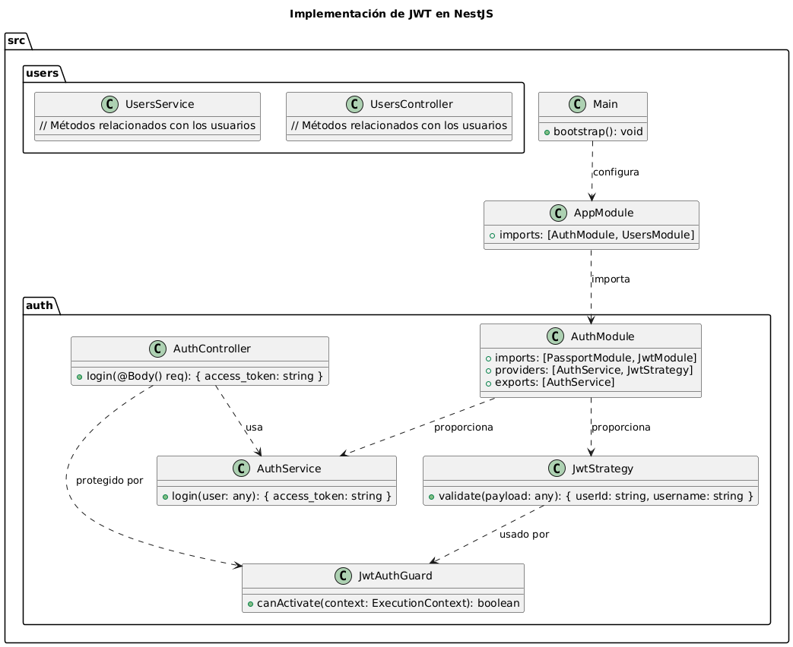

### Teoría y Ejemplo de Implementación de JWT en NestJS

**JSON Web Token (JWT)** es un estándar abierto que define un compacto y autónomo medio para transmitir información de manera segura entre partes como un objeto JSON. La información en un JWT se puede verificar y confiar debido a que está firmada digitalmente. Los JWT pueden ser firmados usando un secreto (con el algoritmo HMAC) o una clave pública/privada utilizando RSA o ECDSA.

En una aplicación web, los JWT se utilizan comúnmente para manejar la autenticación y autorización. Aquí está cómo puedes implementar JWT en una aplicación NestJS.

### Estructura de Archivos

Para una aplicación NestJS que usa JWT, la estructura de archivos sería:

```
src/
│
├── auth/
│   ├── auth.controller.ts
│   ├── auth.module.ts
│   ├── auth.service.ts
│   ├── jwt.strategy.ts
│   ├── jwt-auth.guard.ts
│
├── users/
│   ├── users.controller.ts
│   ├── users.module.ts
│   ├── users.service.ts
│   ├── users.entity.ts
│
├── app.module.ts
└── main.ts
```

### Descripción de Archivos

1. **`auth/auth.controller.ts`**: Controlador para manejar las solicitudes de autenticación (login, registro).
2. **`auth/auth.module.ts`**: Módulo que agrupa todos los componentes relacionados con la autenticación.
3. **`auth/auth.service.ts`**: Servicio que contiene la lógica de autenticación.
4. **`auth/jwt.strategy.ts`**: Estrategia JWT para manejar la validación de tokens.
5. **`auth/jwt-auth.guard.ts`**: Guardia que protege rutas usando la estrategia JWT.
6. **`users/users.controller.ts`**: Controlador para manejar las solicitudes relacionadas con los usuarios.
7. **`users/users.module.ts`**: Módulo que agrupa todos los componentes relacionados con los usuarios.
8. **`users/users.service.ts`**: Servicio que contiene la lógica relacionada con los usuarios.
9. **`users/users.entity.ts`**: Entidad que define la estructura de la tabla de usuarios en la base de datos.
10. **`app.module.ts`**: Módulo raíz de la aplicación que importa y organiza otros módulos.
11. **`main.ts`**: Punto de entrada de la aplicación.

### Implementación de JWT

**1. Crear un Nuevo Proyecto en NestJS**

Asegúrate de tener instalado el CLI de NestJS:

```bash
npm i -g @nestjs/cli
```

Crea un nuevo proyecto:

```bash
nest new nombre-del-proyecto
```

**2. Instalar Dependencias Necesarias**

Instala las librerías necesarias para trabajar con JWT:

```bash
npm install @nestjs/jwt @nestjs/passport passport passport-jwt
npm install --save-dev @types/passport-jwt
```

**3. Crear un Módulo de Autenticación**

Genera el módulo de autenticación:

```bash
nest g mo auth
```

**4. Crear un Servicio de Autenticación**

Crea el servicio de autenticación:

```bash
nest g s auth
```

Implementa la lógica de autenticación en `auth.service.ts`:

```typescript
import { Injectable } from '@nestjs/common';
import { JwtService } from '@nestjs/jwt';

@Injectable()
export class AuthService {
  constructor(private readonly jwtService: JwtService) {}

  async login(user: any) {
    const payload = { username: user.username, sub: user.userId };
    return {
      access_token: this.jwtService.sign(payload),
    };
  }
}
```

**5. Configurar el Módulo JWT**

Configura el módulo JWT dentro de `auth.module.ts`:

```typescript
import { Module } from '@nestjs/common';
import { JwtModule } from '@nestjs/jwt';
import { PassportModule } from '@nestjs/passport';
import { AuthService } from './auth.service';
import { JwtStrategy } from './jwt.strategy';

@Module({
  imports: [
    PassportModule,
    JwtModule.register({
      secret: 'secretKey',
      signOptions: { expiresIn: '60s' },
    }),
  ],
  providers: [AuthService, JwtStrategy],
  exports: [AuthService],
})
export class AuthModule {}
```

**6. Implementar la Estrategia JWT**

Genera y configura la estrategia JWT en `jwt.strategy.ts`:

```typescript
import { Strategy, ExtractJwt } from 'passport-jwt';
import { PassportStrategy } from '@nestjs/passport';
import { Injectable } from '@nestjs/common';

@Injectable()
export class JwtStrategy extends PassportStrategy(Strategy) {
  constructor() {
    super({
      jwtFromRequest: ExtractJwt.fromAuthHeaderAsBearerToken(),
      ignoreExpiration: false,
      secretOrKey: 'secretKey',
    });
  }

  async validate(payload: any) {
    return { userId: payload.sub, username: payload.username };
  }
}
```

**7. Proteger Rutas con JWT**

Genera el guardia JWT:

```bash
nest g gu auth/jwt-auth
```

Configura el guardia en `jwt-auth.guard.ts`:

```typescript
import { Injectable, ExecutionContext } from '@nestjs/common';
import { AuthGuard } from '@nestjs/passport';

@Injectable()
export class JwtAuthGuard extends AuthGuard('jwt') {}
```

Aplica el guardia en un controlador, por ejemplo `profile.controller.ts`:

```typescript
import { Controller, Get, UseGuards } from '@nestjs/common';
import { JwtAuthGuard } from './auth/jwt-auth.guard';

@Controller('profile')
export class ProfileController {
  @UseGuards(JwtAuthGuard)
  @Get()
  getProfile() {
    return { message: 'This is a protected route' };
  }
}
```

**8. Crear un Controlador de Autenticación**

Genera y configura el controlador de autenticación:

```bash
nest g co auth
```

Implementa el método de login en `auth.controller.ts`:

```typescript
import { Controller, Post, Body } from '@nestjs/common';
import { AuthService } from './auth.service';

@Controller('auth')
export class AuthController {
  constructor(private readonly authService: AuthService) {}

  @Post('login')
  async login(@Body() req) {
    return this.authService.login(req);
  }
}
```

**9. Ejecutar la Aplicación y Probar la Autenticación**

Inicia la aplicación:

```bash
npm run start
```

Realiza una solicitud POST a `/auth/login` para obtener un token JWT. Usa ese token para acceder a rutas protegidas.

# Imagen de flujo 


### Explicación del Diagrama UML

- **`AuthService`**: Proporciona la lógica para generar tokens JWT.
- **`AuthController`**: Controlador que maneja las solicitudes de autenticación.
- **`JwtStrategy`**: Estrategia para validar tokens JWT.
- **`JwtAuthGuard`**: Guardia que protege las rutas usando la estrategia JWT.
- **`AuthModule`**: Módulo que agrupa los componentes de autenticación.
- **`AppModule`**: Módulo raíz que importa `AuthModule` y otros módulos.
- **`Main`**: Configura la aplicación.
