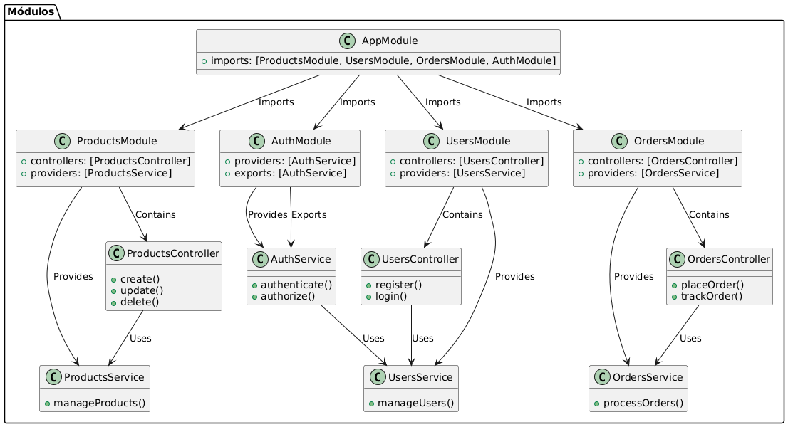

¡Claro! Aquí tienes una explicación detallada sobre los módulos en NestJS, junto con un diagrama en PlantUML que muestra cómo se relacionan.

---

### 📦 Módulos en NestJS

**🌟 ¿Qué son los Módulos?**
Los módulos en NestJS son unidades lógicas que agrupan funcionalidades relacionadas. Cada módulo puede contener controladores, servicios, y otros módulos. Esto ayuda a organizar y estructurar la aplicación de manera eficiente.

**🎯 ¿Por qué usar Módulos en NestJS?**
1. **Organización del Código:**
   - Agrupa funcionalidades relacionadas, facilitando la organización y comprensión del código.

2. **Facilidad de Mantenimiento:**
   - Los cambios en un módulo afectan solo a ese módulo, reduciendo el riesgo de errores y mejorando la estabilidad.

3. **Escalabilidad:**
   - Permite agregar nuevos módulos fácilmente, facilitando la expansión y escalabilidad de la aplicación.

4. **Reutilización:**
   - Los módulos pueden ser reutilizados en diferentes partes de la aplicación o en otros proyectos, reduciendo la duplicación de código.

**🔧 ¿Cómo funcionan los Módulos en NestJS?**

1. **Creación de un Módulo:**

   Puedes crear un módulo utilizando el CLI de NestJS:
   ```bash
   nest g mo users
   ```

   Esto generará un archivo `users.module.ts` con la siguiente estructura básica:
   ```typescript
   import { Module } from '@nestjs/common';
   import { UsersService } from './users.service';
   import { UsersController } from './users.controller';

   @Module({
     controllers: [UsersController],
     providers: [UsersService],
   })
   export class UsersModule {}
   ```

   **Explicación:**
   - **`@Module()`**: Define la clase como un módulo.
   - **`controllers`**: Lista los controladores para el módulo.
   - **`providers`**: Lista los servicios que serán inyectados en el módulo.

2. **Importación y Exportación de Módulos:**

   Puedes importar otros módulos y exportar servicios:
   ```typescript
   import { Module } from '@nestjs/common';
   import { UsersModule } from './users/users.module';
   import { AuthService } from './auth/auth.service';

   @Module({
     imports: [UsersModule],
     providers: [AuthService],
     exports: [AuthService],
   })
   export class AuthModule {}
   ```

   **Consejo:** Utiliza `exports` para compartir servicios con otros módulos.

3. **Módulos Globales:**

   Puedes hacer que un módulo sea global para que sus servicios estén disponibles en toda la aplicación:
   ```typescript
   import { Module, Global } from '@nestjs/common';

   @Global()
   @Module({
     providers: [AuthService],
     exports: [AuthService],
   })
   export class AuthModule {}
   ```

   **Ventaja:** Simplifica el acceso a servicios compartidos y evita importar el módulo en cada lugar.

**🌐 Ejemplo Avanzado: Módulos en una Aplicación Compleja**

Supongamos una aplicación de comercio electrónico con los siguientes módulos:
- **ProductsModule**: Maneja productos.
- **UsersModule**: Maneja usuarios.
- **OrdersModule**: Maneja pedidos.
- **AuthModule**: Maneja autenticación.

El módulo principal `AppModule` podría verse así:
```typescript
import { Module } from '@nestjs/common';
import { ProductsModule } from './products/products.module';
import { UsersModule } from './users/users.module';
import { OrdersModule } from './orders/orders.module';
import { AuthModule } from './auth/auth.module';

@Module({
  imports: [ProductsModule, UsersModule, OrdersModule, AuthModule],
})
export class AppModule {}
```

**🎓 Conclusión**
Los módulos en NestJS permiten construir aplicaciones organizadas y mantenibles. Dividir la aplicación en módulos ayuda a gestionar la complejidad, mejorar la reutilización del código y facilitar la colaboración en proyectos grandes.

# Imagen de flujo 


### Explicación del Diagrama

1. **Módulos:**
   - **`AppModule`**: Módulo principal que importa otros módulos.
   - **`ProductsModule`, `UsersModule`, `OrdersModule`, `AuthModule`**: Módulos específicos para manejar diferentes aspectos de la aplicación.

2. **Controladores y Servicios:**
   - Cada módulo contiene uno o más controladores y servicios.
   - **Controladores**: Manejan las solicitudes HTTP.
   - **Servicios**: Proporcionan la lógica de negocio y pueden ser inyectados en los controladores.

3. **Relaciones:**
   - **Importaciones**: Módulos importan otros módulos para utilizar sus funcionalidades.
   - **Contenidos y Proveedores**: Los módulos contienen controladores y proporcionan servicios.
   - **Uso de Servicios**: Los controladores utilizan servicios para manejar la lógica de negocio.

Este diagrama ayuda a visualizar cómo los módulos interactúan y se organizan en una aplicación de NestJS, facilitando la comprensión de la estructura y la gestión del código.