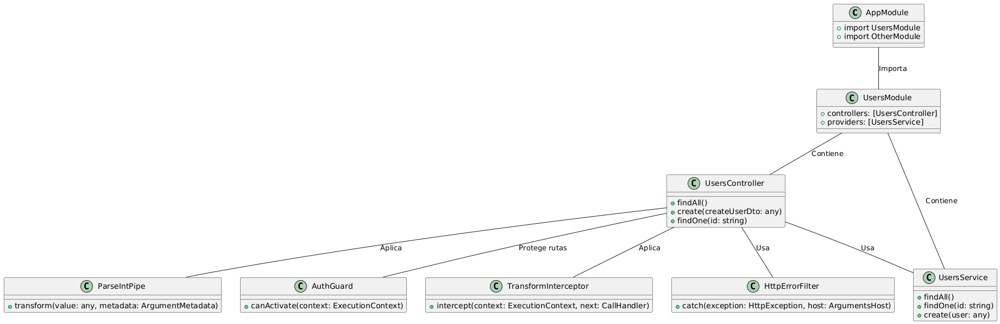

### Resumen de los Elementos Fundamentales de NestJS

NestJS es un framework para aplicaciones del lado del servidor en TypeScript, diseñado para ser modular y escalable. A continuación, un resumen de los bloques de construcción esenciales:

#### 1. **Módulos**

**Teoría**: Agrupan controladores, proveedores y otros módulos, organizando la funcionalidad en partes distintas.

**Código**:
```typescript
import { Module } from '@nestjs/common';
import { UsersController } from './users/users.controller';
import { UsersService } from './users/users.service';

@Module({
  controllers: [UsersController],
  providers: [UsersService],
})
export class UsersModule {}
```
**Comentario**: `@Module()` define un módulo. Aquí, `UsersModule` encapsula `UsersController` y `UsersService`.

#### 2. **Controladores**

**Teoría**: Manejan solicitudes HTTP y devuelven respuestas. Definen rutas y asocian métodos a estas rutas.

**Código**:
```typescript
import { Controller, Get, Post, Body, Param } from '@nestjs/common';
import { UsersService } from './users.service';

@Controller('users')
export class UsersController {
  constructor(private readonly usersService: UsersService) {}

  @Get()
  findAll() {
    return this.usersService.findAll();
  }

  @Post()
  create(@Body() createUserDto: any) {
    return this.usersService.create(createUserDto);
  }

  @Get(':id')
  findOne(@Param('id') id: string) {
    return this.usersService.findOne(id);
  }
}
```
**Comentario**: `@Controller('users')` define las rutas asociadas con el controlador. Los métodos `findAll()`, `create()` y `findOne()` manejan las solicitudes HTTP correspondientes.

#### 3. **Servicios (Providers)**

**Teoría**: Encapsulan la lógica de negocio. Se pueden inyectar en controladores y otros servicios.

**Código**:
```typescript
import { Injectable } from '@nestjs/common';

@Injectable()
export class UsersService {
  private users = [];

  findAll() {
    return this.users;
  }

  findOne(id: string) {
    return this.users.find(user => user.id === id);
  }

  create(user) {
    this.users.push(user);
    return user;
  }
}
```
**Comentario**: `@Injectable()` marca la clase `UsersService` como un proveedor que puede ser inyectado.

#### 4. **Pipes**

**Teoría**: Transforman y validan datos antes de que lleguen al controlador.

**Código**:
```typescript
import { PipeTransform, Injectable, ArgumentMetadata, BadRequestException } from '@nestjs/common';

@Injectable()
export class ParseIntPipe implements PipeTransform {
  transform(value: any, metadata: ArgumentMetadata) {
    const val = parseInt(value, 10);
    if (isNaN(val)) {
      throw new BadRequestException('Validation failed');
    }
    return val;
  }
}
```
**Comentario**: `@UsePipes()` aplica pipes para validar y transformar datos de entrada.

#### 5. **Guardias (Guards)**

**Teoría**: Determinan si se permite el acceso a una ruta o método basado en la lógica de autorización.

**Código**:
```typescript
import { Injectable, CanActivate, ExecutionContext } from '@nestjs/common';
import { Observable } from 'rxjs';

@Injectable()
export class AuthGuard implements CanActivate {
  canActivate(
    context: ExecutionContext,
  ): boolean | Promise<boolean> | Observable<boolean> {
    const request = context.switchToHttp().getRequest();
    const token = request.headers.authorization;
    return token && token === 'valid-token'; // Lógica de autorización simple
  }
}
```
**Comentario**: `@UseGuards()` aplica guardias que gestionan la autorización.

#### 6. **Interceptors**

**Teoría**: Permiten modificar la respuesta o manejar el proceso de solicitud adicionalmente, como la creación de logs.

**Código**:
```typescript
import {
  Injectable,
  NestInterceptor,
  ExecutionContext,
  CallHandler,
} from '@nestjs/common';
import { Observable } from 'rxjs';
import { map } from 'rxjs/operators';

@Injectable()
export class TransformInterceptor implements NestInterceptor {
  intercept(context: ExecutionContext, next: CallHandler): Observable<any> {
    return next.handle().pipe(map(data => ({ data })));
  }
}
```
**Comentario**: `@UseInterceptors()` aplica interceptores para transformar respuestas.

#### 7. **Filtros de Excepciones (Exception Filters)**

**Teoría**: Manejan y personalizan la respuesta ante errores en la aplicación.

**Código**:
```typescript
import { ExceptionFilter, Catch, ArgumentsHost, HttpException } from '@nestjs/common';

@Catch(HttpException)
export class HttpErrorFilter implements ExceptionFilter {
  catch(exception: HttpException, host: ArgumentsHost) {
    const ctx = host.switchToHttp();
    const response = ctx.getResponse();
    const status = exception.getStatus();

    response.status(status).json({
      statusCode: status,
      message: exception.message,
    });
  }
}
```
**Comentario**: `@Catch()` define un filtro de excepciones para manejar y personalizar errores.

### Ejemplo en PlantUML

Claro, aquí tienes un diagrama PlantUML que ilustra la relación entre los elementos fundamentales de NestJS que mencionaste:

# Imagen de flujo 


### Explicación del Diagrama UML

1. **`AppModule`**: Es el módulo raíz de la aplicación.
   - Importa `UsersModule` y otros módulos necesarios para la aplicación.

2. **`UsersModule`**: Módulo específico para la funcionalidad de usuarios.
   - Contiene `UsersController` y `UsersService`.

3. **`UsersController`**: Controlador que maneja las rutas relacionadas con los usuarios.
   - Usa `UsersService` para la lógica de negocio.
   - Aplica `ParseIntPipe` para la validación de datos.
   - Protege rutas con `AuthGuard`.
   - Utiliza `TransformInterceptor` para transformar respuestas.
   - Usa `HttpErrorFilter` para manejar excepciones.

4. **`UsersService`**: Servicio que encapsula la lógica de negocio para usuarios.
   - Proporciona métodos para `findAll`, `findOne`, y `create`.

5. **`ParseIntPipe`**: Pipe para validar y transformar datos de entrada.

6. **`AuthGuard`**: Guardia que controla el acceso a las rutas basándose en la autorización.

7. **`TransformInterceptor`**: Interceptor que transforma la respuesta antes de enviarla al cliente.

8. **`HttpErrorFilter`**: Filtro de excepciones que maneja y personaliza la respuesta de errores.

Este diagrama muestra cómo los distintos bloques de construcción de NestJS interactúan entre sí para formar una aplicación estructurada y modular.