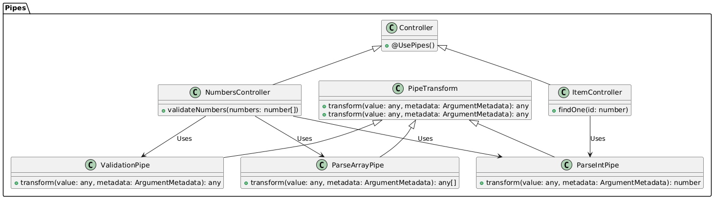

# 🧪 Pipes en NestJS

**🌟 ¿Qué son los Pipes?**

En NestJS, los pipes son herramientas esenciales que permiten transformar, validar y manipular datos antes de que lleguen a los controladores. Actúan como un filtro en el flujo de datos, garantizando que la información que se procesa esté en el formato y estado deseado.

**🎯 ¿Por qué usar Pipes en NestJS?**

1. **Validación de Datos Precisa:**
   - Los pipes proporcionan un mecanismo centralizado y uniforme para validar datos. Esto asegura que, por ejemplo, un parámetro que se espera sea un número entero, lo sea antes de ser procesado por el controlador.

2. **Transformación Dinámica de Datos:**
   - Permiten transformar los datos según sea necesario antes de que lleguen al controlador. Esto es útil para convertir cadenas de texto a tipos específicos como números o booleanos.

3. **Manejo Elegante de Errores:**
   - Los pipes pueden lanzar excepciones personalizadas si los datos no cumplen con los criterios definidos, permitiendo un manejo uniforme y claro de errores.

**🔧 ¿Cómo funcionan los Pipes en NestJS?**

1. **Creación de un Pipe Personalizado:**

   Para crear un pipe personalizado, debes implementar la interfaz `PipeTransform` y sobrescribir el método `transform`. Aquí tienes un ejemplo de un pipe que convierte y valida un número entero:

   ```typescript
   import { PipeTransform, Injectable, ArgumentMetadata, BadRequestException } from '@nestjs/common';

   @Injectable()
   export class ParseIntPipe implements PipeTransform {
     transform(value: any, metadata: ArgumentMetadata) {
       const val = parseInt(value, 10);
       if (isNaN(val)) {
         throw new BadRequestException(`El valor ${value} no es un número entero válido`);
       }
       return val;
     }
   }
   ```

   **Explicación:**
   - **`PipeTransform`**: Define la estructura básica para cualquier pipe personalizado.
   - **`transform`**: Método que recibe los datos y realiza la conversión o validación. Lanza una excepción si los datos no son válidos.

2. **Aplicación de Pipes:**

   Los pipes se pueden aplicar en diferentes niveles: globalmente, a nivel de controlador, o en métodos específicos.

   - **Aplicación Global:**
     Aplica un pipe globalmente a todas las rutas de la aplicación:
     ```typescript
     import { ValidationPipe } from '@nestjs/common';

     async function bootstrap() {
       const app = await NestFactory.create(AppModule);
       app.useGlobalPipes(new ValidationPipe());
       await app.listen(3000);
     }
     bootstrap();
     ```

   - **Aplicación en un Controlador o Método Específico:**
     Aplica un pipe a nivel de controlador o método:
     ```typescript
     import { Controller, Get, Param, UsePipes } from '@nestjs/common';
     import { ParseIntPipe } from './parse-int.pipe';

     @Controller('items')
     export class ItemsController {
       @Get(':id')
       @UsePipes(ParseIntPipe)
       findOne(@Param('id') id: number) {
         return `Item con ID: ${id}`;
       }
     }
     ```

   **Pro Tip:** Puedes combinar varios pipes para aplicar múltiples transformaciones y validaciones en cadena.

3. **Pipes Incorporados en NestJS:**

   NestJS ofrece varios pipes predefinidos para tareas comunes:
   - **`ValidationPipe`**: Valida automáticamente las entradas basadas en decoradores y clases DTO.
   - **`ParseIntPipe`**: Convierte cadenas de texto a números enteros.
   - **`ParseBoolPipe`**: Convierte cadenas de texto como "true" o "false" a valores booleanos.
   - **`ParseArrayPipe`**: Convierte cadenas en arrays y permite validar y transformar los elementos del array.

**🚀 Ejemplo Avanzado: Combinación de Pipes**

Supongamos que tienes una ruta en tu API que recibe un array de números, convierte cada uno a entero, y asegura que todos son positivos. Aquí es donde los pipes realmente muestran su poder:

```typescript
import { Controller, Post, Body, UsePipes, ParseArrayPipe, ValidationPipe, ParseIntPipe } from '@nestjs/common';

@Controller('numbers')
export class NumbersController {
  @Post()
  @UsePipes(
    new ParseArrayPipe({ items: Number }),  // Convierte las cadenas en números
    ParseIntPipe,  // Asegura que cada número es un entero
    ValidationPipe  // Realiza validaciones adicionales si es necesario
  )
  validateNumbers(@Body() numbers: number[]) {
    // Aquí se puede agregar lógica adicional para verificar que los números sean positivos
    if (numbers.some(num => num <= 0)) {
      throw new BadRequestException('Todos los números deben ser positivos');
    }
    return `Numbers are valid: ${numbers}`;
  }
}
```

**🎓 Conclusión**

Los pipes en NestJS son una herramienta poderosa para garantizar que los datos entrantes sean correctos y estén en el formato adecuado antes de ser procesados. Al usar pipes, puedes validar, transformar y manejar errores de manera eficiente, contribuyendo a la robustez y mantenimiento de la aplicación. Aprovechar al máximo los pipes te ayudará a construir aplicaciones NestJS más seguras y elegantes.


# Imagen de flujo 


**Explicación del Diagrama:**
- **`PipeTransform`**: Interfaz base para todos los pipes.
- **`ParseIntPipe`, `ValidationPipe`, `ParseArrayPipe`**: Ejemplos de pipes personalizados y predefinidos.
- **`Controller`**: Utiliza pipes a nivel de métodos.
- **`ItemController`** y **`NumbersController`**: Ejemplos de controladores que aplican pipes para validar y transformar datos.
