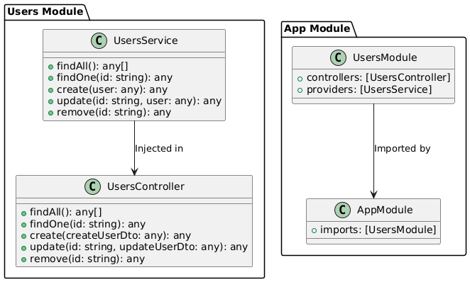

Mis disculpas por eso. Vamos a hacer una versión más resumida, comentada y con un diagrama en PlantUML para los **Servicios en NestJS**.

### 💼 Servicios en NestJS

#### 🌟 ¿Qué son los Servicios en NestJS?

Los **servicios** en NestJS son clases que encapsulan la lógica de negocio y pueden ser reutilizadas en diferentes partes de la aplicación. Su principal función es separar la lógica de negocio de los controladores, facilitando la modularidad, mantenibilidad y testabilidad del código.

#### 🎯 ¿Por qué usar Servicios en NestJS?

1. **Encapsulación de la Lógica de Negocio:**
   Mantiene la lógica de negocio separada de los controladores, facilitando su mantenimiento y organización.

2. **Reutilización del Código:**
   Permite reutilizar la misma lógica en diferentes controladores o módulos, reduciendo la duplicación.

3. **Facilidad de Pruebas:**
   Facilita las pruebas unitarias al permitir probar la lógica de negocio de manera aislada.

4. **Inyección de Dependencias:**
   Aprovecha el sistema de inyección de dependencias de NestJS para gestionar instancias de servicios.

#### 🔧 ¿Cómo funcionan los Servicios en NestJS?

1. **Creación de un Servicio:**

   Utiliza el CLI para generar un servicio:

   ```bash
   nest g s users
   ```

   **Código Básico:**

   ```typescript
   import { Injectable } from '@nestjs/common';

   @Injectable()
   export class UsersService {
     private users = []; // Datos en memoria

     findAll() {
       return this.users; // Retorna todos los usuarios
     }

     findOne(id: string) {
       return this.users.find(user => user.id === id); // Retorna un usuario por ID
     }

     create(user) {
       this.users.push(user); // Crea un nuevo usuario
       return user;
     }

     update(id: string, user) {
       const existingUser = this.findOne(id);
       if (existingUser) {
         Object.assign(existingUser, user); // Actualiza usuario existente
         return existingUser;
       }
       return null;
     }

     remove(id: string) {
       const index = this.users.findIndex(user => user.id === id);
       if (index !== -1) {
         const removedUser = this.users.splice(index, 1); // Elimina usuario
         return removedUser[0];
       }
       return null;
     }
   }
   ```

   **Comentarios:**
   - `@Injectable()`: Permite que la clase sea inyectada en otros componentes.
   - Métodos CRUD: Operaciones básicas sobre una colección en memoria.

2. **Inyección de un Servicio en un Controlador:**

   **Código:**

   ```typescript
   import { Controller, Get, Post, Body, Param, Put, Delete } from '@nestjs/common';
   import { UsersService } from './users.service';

   @Controller('users')
   export class UsersController {
     constructor(private readonly usersService: UsersService) {}

     @Get()
     findAll() {
       return this.usersService.findAll();
     }

     @Get(':id')
     findOne(@Param('id') id: string) {
       return this.usersService.findOne(id);
     }

     @Post()
     create(@Body() createUserDto: any) {
       return this.usersService.create(createUserDto);
     }

     @Put(':id')
     update(@Param('id') id: string, @Body() updateUserDto: any) {
       return this.usersService.update(id, updateUserDto);
     }

     @Delete(':id')
     remove(@Param('id') id: string) {
       return this.usersService.remove(id);
     }
   }
   ```

   **Comentarios:**
   - El controlador utiliza el servicio para realizar operaciones CRUD, manteniendo la lógica de negocio separada.

3. **Configuración de un Módulo:**

   **Código:**

   ```typescript
   import { Module } from '@nestjs/common';
   import { UsersService } from './users.service';
   import { UsersController } from './users.controller';

   @Module({
     controllers: [UsersController],
     providers: [UsersService],
   })
   export class UsersModule {}
   ```

   **Comentarios:**
   - `providers`: Registra los servicios para que puedan ser inyectados en el módulo.

4. **Ejemplo Completo: Servicio Avanzado con Integración de Base de Datos**

   **Código con TypeORM:**

   ```typescript
   import { Injectable } from '@nestjs/common';
   import { InjectRepository } from '@nestjs/typeorm';
   import { Repository } from 'typeorm';
   import { User } from './entities/user.entity';
   import { CreateUserDto } from './dto/create-user.dto';
   import { UpdateUserDto } from './dto/update-user.dto';

   @Injectable()
   export class UsersService {
     constructor(
       @InjectRepository(User)
       private usersRepository: Repository<User>,
     ) {}

     findAll(): Promise<User[]> {
       return this.usersRepository.find();
     }

     findOne(id: string): Promise<User> {
       return this.usersRepository.findOne(id);
     }

     async create(createUserDto: CreateUserDto): Promise<User> {
       const user = this.usersRepository.create(createUserDto);
       return this.usersRepository.save(user);
     }

     async update(id: string, updateUserDto: UpdateUserDto): Promise<User> {
       await this.usersRepository.update(id, updateUserDto);
       return this.findOne(id);
     }

     async remove(id: string): Promise<void> {
       await this.usersRepository.delete(id);
     }
   }
   ```

   **Comentarios:**
   - `@InjectRepository(User)`: Inyecta el repositorio para la entidad `User`, permitiendo interactuar con la base de datos.

# 🌐 Imagen de flujo 


### 🎓 Conclusión

Los servicios en NestJS son clave para la lógica de negocio, ayudando a construir aplicaciones modulares y mantenibles. Su uso permite una separación clara de responsabilidades, facilitando la reutilización del código y la realización de pruebas. El ejemplo avanzado con TypeORM muestra cómo integrar servicios con bases de datos para aplicaciones más robustas.