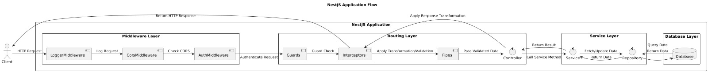

# 🏗️ Estructura Recomendada del Módulo en NestJS

En una aplicación NestJS bien organizada, estructurar los módulos de manera efectiva es crucial para la mantenibilidad, escalabilidad y claridad. Aquí tienes una estructura recomendada para el directorio `src` en una aplicación NestJS:

```
src
 ├── common
 │   ├── decorators
 │   ├── dtos
 │   ├── filters
 │   ├── guards
 │   ├── interceptors
 │   ├── middleware
 │   ├── pipes
 │   ├── common.controller.ts
 │   ├── common.module.ts
 │   └── common.service.ts
 ├── modules
 │   ├── users
 │   │   ├── dtos
 │   │   ├── entities
 │   │   ├── users.controller.ts
 │   │   ├── users.module.ts
 │   │   ├── users.service.ts
 │   │   └── users.repository.ts
 │   ├── auth
 │   │   ├── dtos
 │   │   ├── guards
 │   │   ├── strategies
 │   │   ├── auth.controller.ts
 │   │   ├── auth.module.ts
 │   │   ├── auth.service.ts
 │   │   └── auth.repository.ts
 │   ├── products
 │   │   ├── dtos
 │   │   ├── entities
 │   │   ├── products.controller.ts
 │   │   ├── products.module.ts
 │   │   ├── products.service.ts
 │   │   └── products.repository.ts
 ├── app.module.ts
 ├── main.ts
 └── config
     ├── config.module.ts
     ├── config.service.ts
     └── configuration.ts
```

**Desglose Detallado:**

1. **Directorio `common`:**
   - **`decorators`**: Contiene decoradores personalizados utilizados en toda la aplicación. Ejemplos incluyen decoradores para logging o validación.
   - **`dtos`**: Objetos de Transferencia de Datos utilizados en diferentes módulos para validación y transformación de datos.
   - **`filters`**: Filtros de excepción para manejar y transformar excepciones.
   - **`guards`**: Guardias para la protección de rutas y lógica de autorización.
   - **`interceptors`**: Interceptores para modificar solicitudes y respuestas.
   - **`middleware`**: Middleware para el procesamiento y manipulación de solicitudes.
   - **`pipes`**: Pipes para la transformación y validación de datos.
   - **`common.controller.ts`**: Un controlador base para funcionalidades comunes o rutas compartidas.
   - **`common.module.ts`**: Módulo que encapsula funcionalidades comunes y proveedores.
   - **`common.service.ts`**: Servicio que proporciona funcionalidades comunes utilizadas en otros módulos.

2. **Directorio `modules`:**
   - **`users`**, **`auth`**, **`products`**: Módulos de ejemplo, cada uno con sus propios:
     - **`dtos`**: Objetos de Transferencia de Datos específicos del módulo.
     - **`entities`**: Entidades o modelos utilizados en el módulo (por ejemplo, modelos de base de datos).
     - **`controller.ts`**: Archivo del controlador para manejar solicitudes HTTP relacionadas con el módulo.
     - **`module.ts`**: Definición del módulo que agrupa controladores, servicios y otros proveedores.
     - **`service.ts`**: Servicio que contiene la lógica de negocio para el módulo.
     - **`repository.ts`**: Repositorio para interacciones con la base de datos (si usas TypeORM u ORM similar).

3. **Archivos de Nivel Raíz:**
   - **`app.module.ts`**: El módulo raíz que importa y configura los módulos de la aplicación.
   - **`main.ts`**: El punto de entrada para la aplicación, donde NestJS inicializa y arranca el servidor.
   - **`config`**: Archivos y servicios de configuración para gestionar la configuración de la aplicación.

**Consideraciones Clave:**

- **Separación de Preocupaciones:** Cada módulo debe encapsular su propia funcionalidad, facilitando su gestión y pruebas.
- **Escalabilidad:** A medida que la aplicación crece, puedes agregar nuevos módulos en el directorio `modules`, siguiendo la misma estructura.
- **Reusabilidad:** La funcionalidad común se coloca en el directorio `common` para ser reutilizada en diferentes módulos.

**Ejemplo de Uso:**

Aquí tienes un breve ejemplo de cómo se aplica esta estructura:

**`src/modules/users/users.module.ts`:**
```typescript
import { Module } from '@nestjs/common';
import { UsersController } from './users.controller';
import { UsersService } from './users.service';
import { UsersRepository } from './users.repository';

@Module({
  controllers: [UsersController],
  providers: [UsersService, UsersRepository],
  exports: [UsersService],
})
export class UsersModule {}
```

**`src/modules/users/users.controller.ts`:**
```typescript
import { Controller, Get, Post, Body, Param } from '@nestjs/common';
import { UsersService } from './users.service';
import { CreateUserDto } from './dtos/create-user.dto';

@Controller('users')
export class UsersController {
  constructor(private readonly usersService: UsersService) {}

  @Get()
  findAll() {
    return this.usersService.findAll();
  }

  @Post()
  create(@Body() createUserDto: CreateUserDto) {
    return this.usersService.create(createUserDto);
  }
}
```

**`src/modules/users/users.service.ts`:**
```typescript
import { Injectable } from '@nestjs/common';
import { UsersRepository } from './users.repository';
import { CreateUserDto } from './dtos/create-user.dto';

@Injectable()
export class UsersService {
  constructor(private readonly usersRepository: UsersRepository) {}

  async findAll() {
    return this.usersRepository.findAll();
  }

  async create(createUserDto: CreateUserDto) {
    return this.usersRepository.create(createUserDto);
  }
}
```

# Imagen de flujo 

