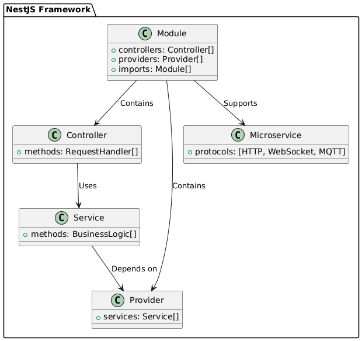

# 🤔 ¿Por Qué Elegir NestJS?

#### 🌟 Introducción

NestJS es un framework para Node.js basado en TypeScript, conocido por su arquitectura modular y soporte avanzado, ideal para aplicaciones escalables y mantenibles. A continuación, se detallan las razones por las que es una excelente elección.

#### 🎯 Razones para Usar NestJS

1. **Arquitectura Modular y Escalable:**

   - **Explicación:** NestJS organiza la aplicación en módulos, lo que facilita la división en partes más manejables. Esto permite que diferentes equipos trabajen en módulos específicos, mejorando la colaboración y el desarrollo continuo.
   - **Ejemplo:** Imagina un sistema de comercio electrónico con módulos para productos, pedidos y usuarios. Cada módulo puede ser desarrollado y mantenido de forma independiente.

   ```typescript
   @Module({
     imports: [ProductsModule, OrdersModule, UsersModule], // Modularidad
   })
   export class AppModule {}
   ```

2. **Soporte Nativo para TypeScript:**

   - **Explicación:** TypeScript proporciona tipos estáticos, lo que ayuda a detectar errores en tiempo de compilación y mejora la calidad del código. NestJS está construido sobre TypeScript, maximizando sus beneficios.
   - **Curiosidad:** Aunque es posible usar JavaScript, TypeScript es el estándar para NestJS debido a su capacidad para hacer el código más seguro y fácil de mantener.

   ```typescript
   @Injectable()
   export class MyService {
     constructor(private readonly myDependency: Dependency) {} // Inyección de dependencias
   }
   ```

3. **Inyección de Dependencias Integrada:**

   - **Explicación:** La inyección de dependencias en NestJS permite gestionar las dependencias de manera eficiente, promoviendo la modularidad y la prueba del código.
   - **Ejemplo:** Un servicio de pagos puede depender de servicios de transacciones y cuentas. NestJS maneja estas dependencias automáticamente.

   ```typescript
   @Injectable()
   export class PaymentsService {
     constructor(
       private readonly transactionsService: TransactionsService,
       private readonly accountsService: AccountsService,
     ) {}
   }
   ```

4. **Soporte Integrado para Aplicaciones Microservicios:**

   - **Explicación:** NestJS soporta la creación de aplicaciones distribuidas mediante microservicios y diversos protocolos de transporte como HTTP, WebSockets, y MQTT.
   - **Ejemplo:** En una plataforma de streaming, diferentes servicios como usuarios, contenido y pagos pueden comunicarse a través de NestJS.

   ```typescript
   @Module({
     imports: [MicroserviceModule], // Soporte para microservicios
   })
   export class AppModule {}
   ```

5. **Capacidades Avanzadas para Aplicaciones Monolíticas y Basadas en Microservicios:**

   - **Explicación:** NestJS es adecuado tanto para aplicaciones monolíticas como para sistemas basados en microservicios, permitiendo una transición gradual entre ambos enfoques.
   - **Curiosidad:** Aunque se prefieren los microservicios en algunos casos, un buen diseño monolítico aún puede ser más eficiente y sencillo de gestionar.

   ```typescript
   @Module({
     imports: [CommonModule, FeatureModule], // Modularidad en monolitos
   })
   export class AppModule {}
   ```

6. **Soporte Excepcional para Pruebas:**

   - **Explicación:** NestJS se integra con Jest para facilitar pruebas unitarias, de integración y de extremo a extremo.
   - **Ejemplo:** En aplicaciones financieras, las pruebas rigurosas aseguran que cada componente funcione correctamente.

   ```typescript
   import { Test, TestingModule } from '@nestjs/testing';
   import { MyService } from './my.service';

   describe('MyService', () => {
     let service: MyService;

     beforeEach(async () => {
       const module: TestingModule = await Test.createTestingModule({
         providers: [MyService],
       }).compile();

       service = module.get<MyService>(MyService);
     });

     it('should be defined', () => {
       expect(service).toBeDefined();
     });
   });
   ```

7. **Comunidad y Ecosistema en Crecimiento:**

   - **Explicación:** NestJS cuenta con una comunidad activa y un ecosistema en expansión, ofreciendo recursos, tutoriales y soporte.
   - **Curiosidad:** NestJS ha ganado popularidad rápidamente y es adoptado por muchas empresas debido a su robustez y facilidad de uso.

   ```typescript
   @Module({
     imports: [SharedModule], // Ecosistema en crecimiento
   })
   export class AppModule {}
   ```

### 🌐 Casos de Uso Reales

- **Fintech:** Ideal para aplicaciones financieras por su seguridad y capacidad de pruebas.
- **E-commerce:** Perfecto para tiendas en línea con alta transacción y necesidad de escalabilidad.
- **Aplicaciones de IoT:** Soporta múltiples dispositivos y protocolos de comunicación a través de microservicios y WebSockets.

# Imagen de flujo 


### 🎓 Conclusión

NestJS ofrece una solución poderosa para construir aplicaciones modernas, robustas y escalables. Su arquitectura modular, soporte para TypeScript y capacidades avanzadas lo hacen adecuado para una variedad de casos de uso, desde monolitos hasta microservicios. Elegir NestJS garantiza productividad y preparación para el crecimiento futuro de tu aplicación.


Este diagrama ilustra la relación entre módulos, controladores, servicios y microservicios en NestJS.